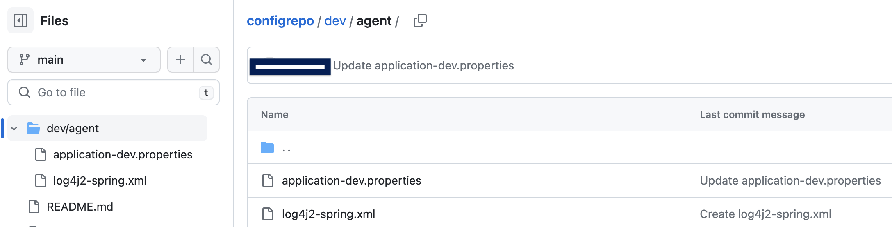

spring-boot-remote-git-autoconfigure
=======================================
It can download the Spring Boot configurations from remote git repo and load the configuration to Spring boot APP

## Prerequisites
You should install the git client successfully and the configure the ssh auto verify with remote git repo successfully. It mean that you can use the OS git command pull the remote configuration repo item successfully.

## Add the dependency jar 
  maven:
```
<dependency>
    <groupId>com.vmware.singleton</groupId>
    <artifactId>spring-boot-remote-git-autoconfigure</artifactId>
    <version>{version}</version>
</dependency>

```
  gradle:
```
implementation 'com.vmware.singleton:spring-boot-remote-git-autoconfigure:{version}'

```

## create the remote git config repository for Spring Boot apps 

You can create git remote repository as following Sample:


It means that:
```
spring.profiles.remote.config.git.uri=git@{your repository address}/configrepo.git
spring.profiles.remote.config.git.branch=main
spring.profiles.remote.config.git.basedir=dev/agent
```

## Add the configuration item to application configuration(application.properties, application.yml, application.yaml)
sample:
```
spring.profiles.active=dev
spring.profiles.remote.config.enable=true
spring.profiles.remote.config.git.uri={you git remote repositoy git ssh address}
spring.profiles.remote.config.git.branch=main
spring.profiles.remote.config.git.basedir=dev/agent

```

It means download the configuration from remote repository under dev/agent DIR

## Start the spring boot app

you can use java -jar xxx.jar command start springboot app

sample
```
java -jar xxx.jar

```


